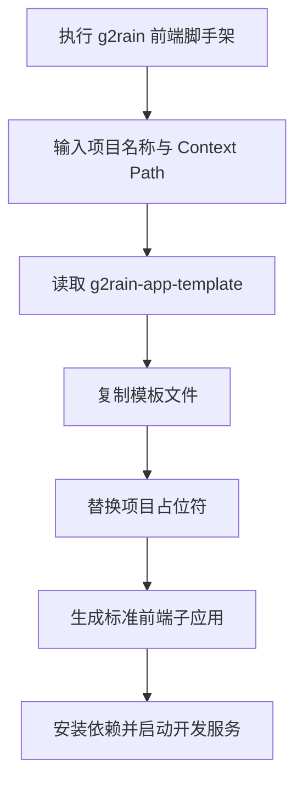



  

# g2rain-app-template

下一代AI软件开发范式，AI原生Agent平台，开源的企业级SaaS底座。

前端应用创建脚手架，基于 g2rain-app-template 生成前端子应用工程；采集项目名称、Context Path 等初始化参数并完成模板替换

[官网](https://www.g2rain.com) · [Issues](https://github.com/g2rain/g2rain/issues) · [Discussions](https://github.com/g2rain/g2rain/discussions)

## 目录

- 项目简介
- 平台定位
- 业务域说明
- 功能概览
- 使用场景
- 核心流程
- 流程图
- 技术栈
- 环境要求
- 快速开始
- 配置说明
- 构建与镜像
- 代码质量与测试
- 安全说明
- 模块说明
- 职责边界
- 常见问题
- 参与贡献
- 许可证
- 联系我们
- 致谢

## 项目简介

前端应用创建脚手架，基于 g2rain-app-template 生成前端子应用工程；采集项目名称、Context Path 等初始化参数并完成模板替换

## 平台定位

该仓库位于 g2rain 前端工程化工具链中，是用于创建前端子应用的脚手架工具。 它主要服务于项目创建阶段，通过模板复制、参数采集与初始化配置生成可继续开发的前端工程，而不是运行时承载业务页面的应用本体。

## 业务域说明

该仓库聚焦于 `前端项目初始化与模板生成`。

核心对象包括：
- Context Path
- 模板路径
- 模板占位符
- 生成后的前端子应用工程
- 项目名称

主要流程包括：
- 项目初始化参数采集流程
- 模板复制与占位符替换流程
- 基于 g2rain-app-template 生成项目流程
- Context Path 写入与初始化配置流程

## 功能概览

| 能力 | 说明 |
| --- | --- |
| 项目初始化 | 通过 CLI 收集项目名称、Context Path 等参数，生成标准前端子应用工程。 |
| 模板复用 | 基于 g2rain-app-template 复制模板文件并执行占位符替换。 |
| 本地调试与构建 | 提供脚手架本地开发与打包命令，便于维护生成逻辑。 |

## 使用场景

| 场景 | 说明 |
| --- | --- |
| 创建标准前端子应用 | 当团队需要快速创建符合 g2rain 微前端规范的 Vue3 + TypeScript 子应用时使用。 |
| 统一 Context Path 与项目命名 | 当新应用需要接入 Shell、网关和部署路径时，由脚手架统一收集并写入项目参数。 |
| 复用组织模板 | 当模板能力升级后，脚手架可继续复用 g2rain-app-template 作为标准工程基线。 |

## 核心流程

| 流程 | 关键步骤 | 代码线索 |
| --- | --- | --- |
| 项目创建流程 | 执行 CLI 命令 → 收集项目名称和 Context Path → 定位模板来源 → 复制模板文件 → 替换占位符 → 输出可运行前端工程 | package.json bin、prompt/input logic、template copy |

## 流程图

## 技术栈

| 类别 | 说明 |
| --- | --- |
| 运行时 | Node.js、npm |
| 前端框架 | vue、vue-router、pinia、vue-i18n、element-plus |
| 构建与类型 | vite、typescript、vue-tsc |
| 微前端 | qiankun、vite-plugin-qiankun |
| 接口与模拟 | axios、mockjs、vite-plugin-mock |
| 部署 | Docker、Nginx |

## 环境要求

- Node.js >=22
- npm
- Docker

## 快速开始

| 步骤 | 命令或位置 | 说明 |
| --- | --- | --- |
| 安装依赖 | `npm install` | 根据 package.json 安装前端依赖。 |
| 本地开发 | `npm run dev` | 以源码方式运行脚手架，便于调试项目生成流程。 |
| 构建产物 | `npm run build` | 执行类型检查与前端构建，生成可发布产物。 |
| 预览产物 | `npm run preview` | 在本地预览构建后的前端产物。 |
| 容器化 | `docker build .` | 仓库提供 Dockerfile，可按组织镜像规范封装前端运行镜像。 |

版本号以项目构建配置为准，当前识别为 `0.1.0`。

## 配置说明

### 运行配置

| 配置项 | 说明 |
| --- | --- |
| `VITE_*` | 前端运行时环境变量，通常由 Vite 与部署环境共同注入。 |

### 路由配置

| 配置项 | 说明 |
| --- | --- |
| `Context Path` | 用于控制前端应用在平台或子路径下的访问基准路径。 |

### 部署配置

| 配置项 | 说明 |
| --- | --- |
| `nginx/default.conf.template` | 容器运行时 Nginx 配置模板，用于静态资源访问和请求转发。 |

## 构建与镜像

| 目标 | 命令 | 产物 | 说明 |
| --- | --- | --- | --- |
| 本地开发 | `npm run dev` | 本地开发服务 | 以源码方式运行脚手架，调试项目生成流程。 |
| 前端产物 | `npm run build` | `dist` | 执行类型检查与 Vite/TypeScript 构建，生成可发布产物。 |
| 产物预览 | `npm run preview` | 本地预览服务 | 在本地预览构建后的前端静态产物。 |
| 容器镜像 | `docker build .` | 前端运行镜像 | 基于 Dockerfile 封装静态前端运行镜像。 |
| 构建脚本 | `./build.sh` | 脚本定义的构建结果 | 执行仓库提供的构建脚本，承载组织内镜像或发布流程。 |

## 代码质量与测试

| 检查项 | 命令 | 说明 |
| --- | --- | --- |
| Vue 类型检查 | `npm run build` | 构建流程中使用 vue-tsc 检查 Vue 与 TypeScript 类型。 |

## 安全说明

| 主题 | 说明 |
| --- | --- |
| 模板来源 | 脚手架生成项目时应使用可信模板来源，避免将未知脚本或配置写入新工程。 |

## 模块说明

| 模块 | 职责说明 | 代码线索 |
| --- | --- | --- |
| 命令入口 | 提供脚手架命令入口，驱动项目创建流程。 | package.json scripts、CLI entry |
| 参数采集 | 采集项目名称、Context Path 等初始化参数。 | prompt/input logic |
| 模板生成 | 复制 g2rain-app-template 并执行占位符替换，生成标准前端子应用。 | g2rain-app-template、template copy |

## 职责边界

该仓库主要负责：
- 负责前端子应用工程初始化
- 负责模板复制、参数化生成与基础配置写入
- 负责项目创建阶段的交互式输入采集

该仓库默认不负责：
- 不负责生成后项目的具体业务实现
- 不负责运行时微前端宿主逻辑
- 不负责后端服务逻辑

## 常见问题

| 问题 | 可能原因 | 处理建议 |
| --- | --- | --- |
| 命令无法执行 | 脚手架未完成依赖安装、未构建或 bin 链接未生效。 | 先安装依赖并确认 package.json bin 配置，再使用 npm link 或构建后的命令入口验证。 |
| 生成项目路径不符合预期 | 项目名称、Context Path 或模板路径参数输入不正确。 | 重新执行脚手架并检查输入参数及 G2RAIN_TEMPLATE_PATH 等模板路径配置。 |

## 参与贡献

我们欢迎所有形式的贡献：Issue 反馈、文档改进、功能建议与代码提交。

推荐流程：

1. Fork 本仓库。
2. 创建特性分支：`git checkout -b feature/your-feature-name`。
3. 提交更改：`git commit -m "Add some feature"`。
4. 推送分支：`git push origin feature/your-feature-name`。
5. 提交 Pull Request。

代码贡献前请尽量补充必要的测试和文档，并确保构建、测试与静态检查通过。

## 许可证

本项目基于 [Apache 2.0许可证](https://github.com/g2rain/g2rain-common/blob/main/LICENSE) 开源。

## 联系我们

- Issues: [GitHub Issues](https://github.com/g2rain/g2rain/issues)
- 讨论: [GitHub Discussions](https://github.com/g2rain/g2rain/discussions)
- 邮箱: g2rain_developer@163.com

## 致谢

感谢所有为 g2rain 项目提交 Issue、代码、文档、建议和使用反馈的开发者们！
