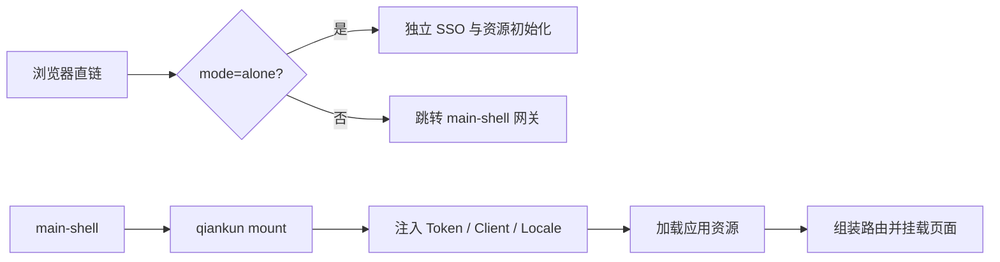

<p align="center">
  
</p>

# g2rain-app-template

[](LICENSE)
[](https://vuejs.org/)
[](https://www.typescriptlang.org/)
[](https://vite.dev/)

g2rain 官方 Vue 3 微前端子应用模板，提供 qiankun 集成、独立运行、SSO/Token、动态资源路由、权限、国际化、HTTP、Mock、业务页面代码生成、资源配置生成和 OpenResty 部署能力。

本仓库是“被生成的应用模板”，不是 CLI 本身。[g2rain-app-cli](https://github.com/g2rain/g2rain-app-cli) 负责复制模板、替换 `{{PROJECT_NAME}}` 与 `{{CONTEXT_PATH}}`，并将包信息和项目文档转换为业务 App 身份；生成后的应用继续使用本仓库内置命令开发页面和生成资源配置。

[官网](https://www.g2rain.com) · [完整文档](docs/index.md) · [中央 Frontend App Profile](https://github.com/g2rain/g2rain/tree/feature/g2rain-architectur-init/docs/architecture/profiles/frontend-app) · [架构说明](docs/architecture/overview.md) · [代码生成](docs/development/code-generation.md) · [资源配置生成](docs/development/resource-generation.md) · [Issues](https://github.com/g2rain/g2rain/issues) · [Discussions](https://github.com/g2rain/g2rain/discussions)

## 核心能力

| 能力 | 当前实现 |
| --- | --- |
| 微前端 | qiankun `bootstrap`、`mount`、`unmount`、`update`，支持同 entry 多 Tab 的 `appKey` 隔离 |
| 双运行模式 | `mode=alone` 独立运行；默认作为集成意图，经 main-shell 网关或 qiankun 运行 |
| 认证 | 独立模式走 SSO，集成模式接收主应用的 `token`、`tokenKid`、`client` 和 `locale` |
| 动态资源 | 登录后从 `/basis/authority/resources` 加载页面、页面元素与 API 端点 |
| 工程生成 | 从 `database.sql` 生成 `view/api/type/mock/route` |
| 资源生成 | 从路由和静态 `v-permission` 生成资源 JSON |
| 部署 | Node 22 构建，OpenResty 托管静态资源并代理 Gateway/IAM，可选 Lua 签名 |

## 目录职责

| 目录 | 职责 | 依赖原则 |
| --- | --- | --- |
| `src/shared` | 环境变量、URL、JWT、通用工具，以及构建期生成器 | 最底层，不依赖应用运行时或业务页面 |
| `src/components` | HTTP、权限、Loading、微前端消息和通用 UI 组件 | 目标上只依赖 shared 与第三方库 |
| `src/platform` | Token、语言、i18n、平台错误模型和微前端平台适配 | 可依赖 components/shared，不承载业务页面 |
| `src/runtime` | 当前应用的认证、HTTP 注入、资源加载、路由和启动编排 | 组合 platform/components/shared，不沉淀跨项目组件 |
| `src/views` | 业务页面、页面 API、类型、Mock 和路由组件注册表 | 可以使用下层能力，不被可复用层反向依赖 |
| `nginx` / `lua` | 容器入口、反向代理、静态资源和可选签名链路 | 部署运行时，不存放前端业务逻辑 |

当前源码仍有少量反向依赖，已登记在[架构偏差](docs/architecture/deviations.md)，不得把它们复制为新代码的默认模式。

## 环境要求

- Node.js `>= 22`
- npm（锁文件版本 3；推荐使用仓库锁定依赖）
- Docker（仅镜像构建需要）

## 快速开始

```bash
npm ci
npm run build
```

独立运行最适合开发和排障。PowerShell：

```powershell
$env:VITE_RUN_MODE = 'alone'
$env:VITE_SERVER_PORT = '3001'
npm run dev
```

也可以在开发服务地址追加 `?mode=alone`。默认空模式表示“集成意图”；若应用未被 qiankun 挂载，会跳转到 `VITE_MAIN_SHELL_REDIRECT_PREFIX`，这不是启动失败。

常用命令：

| 命令 | 说明 |
| --- | --- |
| `npm run dev` | 启动 Vite 开发服务器 |
| `npm run build` | 执行 `vue-tsc` 并构建 `dist` |
| `npm run preview` | 本地预览构建产物 |
| `npm run build:generate -- --tables=dict` | 按 SQL 表生成业务页面骨架 |
| `npm run build:config` | 生成页面和页面元素资源 JSON |

## 代码生成

先把需要生成的 `CREATE TABLE` 放入 `src/shared/generator/database.sql`，再执行：

```bash
npm run build:generate -- --tables=dict
npm run build:generate -- --tables=dict,medicine_users
npm run build:generate -- --tables=dict --no-mock --no-route
```

生成器会写入或覆盖 `src/views/<table>/index.vue`、`api.ts`、`type.ts`、`mock.ts`，并按选项更新 `src/views/route-map.ts`。生成前先检查 Git 状态，生成后必须 Review Diff 并执行 `npm run build`。完整参数、交互式演练和覆盖风险见[代码生成](docs/development/code-generation.md)。

## 资源配置生成

完成页面、路由和权限点后运行：

```bash
npm run build:config
```

当前实现生成：

- `src/shared/config-util/config/resources.json`
- `src/shared/config-util/config/pages.json`
- `src/shared/config-util/config/page-elements.json`

当前 API 端点解析代码尚未接入生成主流程，因此 `resources.json.apiEndpoints` 为空，也不会生成 `api-endpoints.json`。不要仅根据旧说明假设 API 资源已经生成，详见[资源配置生成](docs/development/resource-generation.md)。

## 运行模式



集成模式的 `mount` 必须提供 `container` 和非空 `appKey`；Token 初始化先于资源和路由加载。详细时序见[运行时流程](docs/architecture/runtime-flows.md)。

## 配置与部署

最重要的配对配置：

- 构建期 `VITE_CONTEXT_PATH` 与容器运行期 `CONTEXT_PATH` 必须一致。
- `VITE_APPLICATION_CODE` 必须与平台资源配置的应用编码一致。
- 容器通过 `GATEWAY_HOST/GATEWAY_PORT` 和 `IAM_HOST/IAM_PORT` 分别代理业务接口与认证接口。
- `SSO_BASE_URL` 在容器启动时写入 `env-config.js`。

```bash
docker build --build-arg VITE_BUILD_MODE=production -t g2rain/your-app:latest .
docker run --rm -p 8080:8080 \
  -e SERVER_PORT=8080 \
  -e CONTEXT_PATH=/your-app \
  -e GATEWAY_HOST=gateway \
  -e GATEWAY_PORT=8080 \
  -e IAM_HOST=iam \
  -e IAM_PORT=8080 \
  -e SSO_BASE_URL=https://example.com \
  g2rain/your-app:latest
```

完整变量和安全要求见[配置](docs/operations/configuration.md)、[构建与部署](docs/operations/deployment.md)和[安全边界](docs/security/security-boundaries.md)。

## 文档导航

| 主题 | 入口 |
| --- | --- |
| 项目事实与 Agent 入口 | [docs/project.yaml](docs/project.yaml) · [AGENTS.md](AGENTS.md) |
| 中央基线与项目偏差 | [Frontend App 1.0.0-draft](https://github.com/g2rain/g2rain/tree/feature/g2rain-architectur-init/docs/architecture/profiles/frontend-app) · [本项目偏差](docs/architecture/deviations.md) |
| 架构、层次和依赖 | [架构概览](docs/architecture/overview.md) · [层次职责](docs/architecture/layers.md) · [偏差](docs/architecture/deviations.md) |
| 页面和复用能力 | [Views 规范](docs/development/views-conventions.md) · [Components 与 Platform](docs/development/components-and-platform.md) |
| 生成能力 | [代码生成](docs/development/code-generation.md) · [资源配置生成](docs/development/resource-generation.md) |
| 开发和交付 | [本地开发](docs/development/local-development.md) · [完成定义](docs/development/definition-of-done.md) · [部署](docs/operations/deployment.md) |

## 参与贡献

使用 `feature/<name>` 或 `fix/<name>` 分支向 `develop` 提交，测试环境验证后再合并到 `main`。修改模板会影响所有后续生成项目，请尽量补充必要测试和文档，并确保 `npm run build` 通过。

## 许可证与联系

本项目基于 [Apache License 2.0](LICENSE) 开源。

- 官网：[g2rain.com](https://www.g2rain.com)
- Issues：[GitHub Issues](https://github.com/g2rain/g2rain/issues)
- 讨论：[GitHub Discussions](https://github.com/g2rain/g2rain/discussions)
- 安全问题：[Security Policy](SECURITY.md)
- 邮箱：g2rain_developer@163.com

感谢所有为 g2rain 提交 Issue、代码、文档、建议和使用反馈的开发者。
