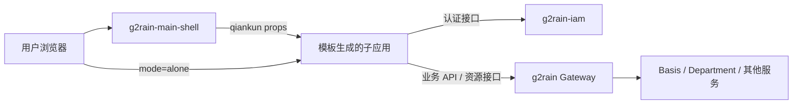
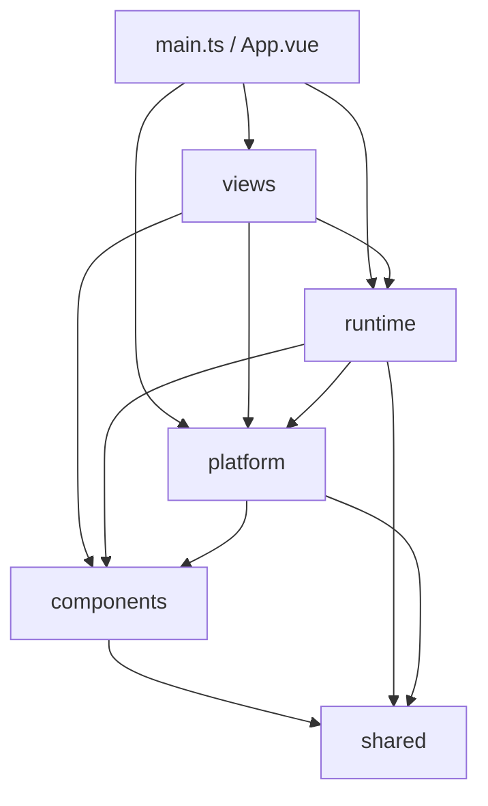

# 架构概览

本项目试点采用 g2rain [`frontend-app 1.0.0-draft`](https://github.com/g2rain/g2rain/tree/feature/g2rain-architectur-init/docs/architecture/profiles/frontend-app)。中央 Profile 管理跨 App 的分层、运行、生成与安全规则；本页描述 g2rain-app-template 的具体落地。

g2rain-app-template 是生成后即可运行的 Vue 3 子应用模板。外部 CLI 负责复制和替换占位符；本仓库负责生成项目的运行架构、平台能力、业务页面约定、生成工具和部署基线。相对中央基线的当前偏差见[架构偏差](deviations.md)。

## 系统关系

- 集成模式由 main-shell 加载子应用并传递 Token、Client、语言和初始路由。
- 独立模式由子应用自行发起 SSO，并在获得 Token 后加载应用资源。
- 业务服务通过 Gateway 暴露；IAM 的认证接口走独立代理路径。
- `/basis/authority/resources` 返回页面、页面元素和 API 端点，运行时据此组装路由与权限。

## 应用内部

图中表示目标依赖。当前源码存在 components/platform 对上层的反向引用，以及 runtime 对 views 注册表的直接引用，详见[架构偏差](deviations.md)。

## 核心事实

- `src/main.ts` 是组合根，负责双模式判断、Vue/Pinia/i18n/Element Plus 装配和 qiankun 生命周期注册。
- `src/platform/apps/adapter.qiankun.ts` 当前承载 qiankun mount/update/unmount 协调。
- `src/runtime/boot` 在 Token 可用后初始化 HTTP、资源、权限和路由。
- `src/views/route-map.ts` 是后端页面资源 `linkPath` 到前端组件的静态注册表。
- `src/shared/generator` 和 `src/shared/config-util` 是构建期工具，不参与浏览器业务运行时。

## 职责边界

本仓库负责模板默认能力和生成后工程结构，不负责：

- 外部 `create-g2rain-app` CLI 的参数交互与文件复制实现。
- main-shell 的菜单、Tab 和子应用注册管理。
- IAM 的 Token 签发与 Gateway 的后端鉴权。
- 具体生成项目的业务领域设计。
- 在本项目文档中静默修改或覆盖中央 Frontend App 公共规则。
