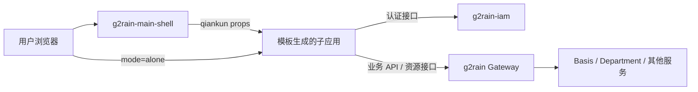
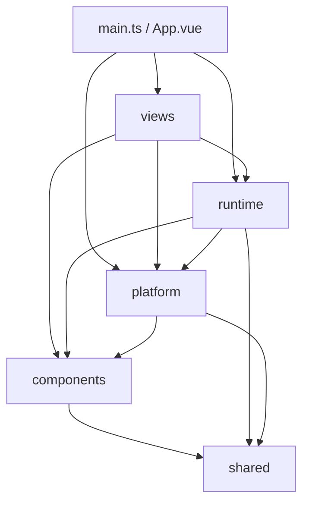

# 架构概览

本项目试点采用 g2rain [`frontend-app 1.0.0-draft`](https://github.com/g2rain/g2rain/tree/feature/g2rain-architectur-init/docs/architecture/profiles/frontend-app)。中央 Profile 管理跨 App 的分层、运行、生成与安全规则；本页描述本模板的具体落地。

g2rain-app-template 是官方 Vue 3 微前端子应用工程模板。本仓库负责模板运行架构、平台能力、示例页面、生成工具和部署配置。相对中央基线的当前偏差见[架构偏差](deviations.md)。

## 系统关系

```mermaid
flowchart LR
  User[用户浏览器] --> Shell[g2rain-main-shell]
  Shell -->|qiankun props| App[模板生成的子应用]
  User -->|mode=alone| App
  App -->|认证接口| IAM[g2rain-iam]
  App -->|业务 API / 资源接口| Gateway[g2rain Gateway]
  Gateway --> Services[Basis / Department / 其他服务]
```

- 集成模式由 main-shell 加载子应用并下发身份字段与 Locale；Token 经 Auth Bridge 定向消息传递。
- 独立模式由子应用自行发起 SSO，并在获得 Token 后加载应用资源。
- 业务服务通过 Gateway 暴露；IAM 的认证接口走独立代理路径。
- `/basis/authority/resources` 返回页面、页面元素和 API 端点，运行时据此组装路由与权限。

## 应用内部

```mermaid
flowchart TD
  Main[main.ts / App.vue] --> Views[views]
  Main --> Runtime[runtime]
  Main --> Platform[platform]
  Views --> Runtime
  Views --> Platform
  Views --> Components[components]
  Runtime --> Platform
  Runtime --> Components
  Platform --> Components
  Components --> Shared[shared]
  Runtime --> Shared
  Platform --> Shared
```

图中表示目标依赖。当前源码存在 components/platform 对上层的反向引用，以及 runtime 对 views 注册表的直接引用，详见[架构偏差](deviations.md)。

## 核心事实

- `src/main.ts` 是组合根。模块加载时创建一次 `createStandardSubPlatform`，独立模式和 qiankun 都调用同一份 `definition.mount` / `unmount`。
- `src/platform/apps/adapter.qiankun.ts` 只注册 qiankun 生命周期，并把 props 交给组合根。
- `src/runtime/boot` 在 Token 可用后初始化 HTTP、资源、权限和路由。`tokenExpired` 监听用引用计数，最后一个实例卸载才停止。
- `src/views/route-map.ts` 是后端页面资源 `linkPath` 到前端组件的静态注册表。
- `scripts/database.sql` 与 `src/shared/config-util/config` 是构建输入/产物；引擎由 `create-g2rain-app` 提供，不参与浏览器业务运行时。

## 职责边界

本仓库负责当前业务应用能力和工程结构，不负责：

- 外部 `create-g2rain-app` CLI 的参数交互与文件复制实现。
- main-shell 的菜单、Tab 和子应用注册管理。
- IAM 的 Token 签发与 Gateway 的后端鉴权。
- 具体生成项目的业务领域设计。
- 在本项目文档中静默修改或覆盖中央 Frontend App 公共规则。
