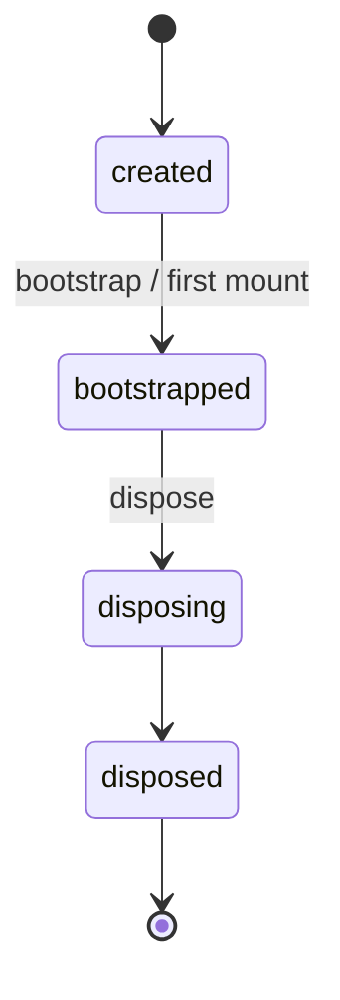

# Platform 生命周期设计

- 状态：拟实施
- 日期：2026-09-20
- 范围：`g2rain-app-template` 的组合根、qiankun 入口与应用级运行资源
- 依据：[Appkit Platform Framework](../../../g2rain-appkit/docs/architecture/platform-framework.md)、[Main Shell 与子应用开发手册](../../../g2rain-appkit/docs/integration/README.md)、[运行时流程](runtime-flows.md)

## 1. 决策摘要

本模板以 `@g2rain/platform/sub` 的一个 **Definition** 作为整份 JavaScript 的生命周期内核。Definition 在模块加载时创建一次；每一次 qiankun `mount` 或独立启动则创建一个以 `instanceId` 为键的 **实例**。两者不能混用：关闭一个工作区页面只能 `unmount(instanceId)`，绝不能 `dispose()` 整个 Definition。

平台资源分为三类：

| 资源 | 所有者 | 创建时机 | 释放时机 |
| --- | --- | --- | --- |
| Definition、跨实例消息处理器、Pinia、HTTP Client、Token Store | 应用会话 | 模块初始化/首次使用 | 浏览器页面结束或受控的整应用销毁 |
| Vue App、Router、路由同步回调、实例 Capability Scope | `instanceId` | 每次成功 mount | 同一 `instanceId` 的 unmount |
| Token 过期监听 | 应用会话，按活动实例引用计数 | 首个成功进入挂载流程 | 最后一个已登记实例退出 |

`applicationCode` 表示稳定应用身份；`viewId` 表示主壳的工作区视图；`instanceId` 表示本次运行实例。宿主必须显式下发三者，且迁移期 `appKey` 必须等于 `instanceId`；不得把 `appKey` 当成 `applicationCode`，也不得在缺少 `instanceId` 时用 `appKey` 回退。

## 2. 所有权与边界

```mermaid
flowchart LR
  Shell[Main Shell] -->|公开 props + Auth Bridge| Entry[main.ts]
  Entry -->|mount/update/unmount| Definition[@g2rain/platform/sub Definition]
  Definition -->|instanceId| Scope[实例 Scope]
  Scope --> App[Vue App + Router + instance listeners]
  Entry --> Session[共享会话资源\nPinia / HTTP / Token]
  Entry --> Watcher[tokenExpired 引用计数]
```

主壳仍拥有工作区、`RuntimeInstance`、每实例操作队列、qiankun handle 与 Tab 的 `mounted/inactive` 状态。子应用不保存这些状态，也不调用 `loadMicroApp`。子应用的 Definition 内部 Map 只拥有本次 mount 建立的实例 Scope。

切换 Tab 不会触发子应用 `unmount`。主壳只标记实例 `inactive`，Vue 与 Router 继续存在。关闭 Tab 才触发 `unmount(instanceId)`；主壳完成 handle 释放后才删除其 RuntimeInstance 和 WorkspaceView。

## 3. Definition 状态机

Appkit 的 Definition 是一次性的，状态为：



- `bootstrap` 只执行一次，按 Capability 依赖顺序建立 Definition Scope。
- `mount` 会在实例 Map 中创建记录、执行实例 Capability、创建应用、再挂载 Vue；任一步失败时反向卸载已完成的 Capability、释放 Scope，并删除该记录。
- `update` 只允许已挂载实例。Capability 更新失败时，已经完成的 Capability 会逆序回滚，应用更新失败时恢复旧 Context。
- `unmount` 先卸载 Vue，再逆序卸载 Capability，最后释放 Scope 并删除实例记录；清理错误必须继续汇总，不能因首个错误遗留资源。
- `dispose` 仅用于真正销毁整份应用 JavaScript（测试、HMR dispose 或可证明页面将终止的宿主）。它等待在途操作、回收全部实例与 Definition Scope；之后 Definition 不可重新 mount。

因此，正常 qiankun `unmount` 不调用 `definition.dispose()`。若未来需要热更新支持，必须在 HMR 回调中先 dispose 旧 Definition，再重新执行模块创建；不能复用已 disposed 的对象。

## 4. 子应用入口协议

### 4.1 mount

集成模式遵循下列顺序：

1. 校验 `container`，解析并校验 `instanceId`、`viewId`、`applicationCode` 与 `contextPath`。
2. 把 `activeRule`、`entryOrigin` 这类非敏感宿主信息放入 `RuntimeContext.metadata`；Token、`tokenKid`、私钥和 Client 不进入 Context、日志或平台消息。
3. 用 `entryOrigin` 更新认证/HTTP 基址，再经 Auth Bridge 将认证载荷写入共享 Token Store。
4. 登记 Token 过期监听的引用，并调用 `definition.mount`。实例 Capability 先同步语言与主题；应用工厂再创建 Vue、Router、路由同步清理函数并挂载。
5. 仅在第 4 步成功后将该实例标记为“已登记监听”。若第 3–4 步失败，必须在 `catch/finally` 中撤销本次登记，避免引用计数泄漏。

独立模式使用相同的 `definition.mount`，但由自身 SSO、根容器与环境变量构造 Context。它不得另建 Vue/Router 生命周期。

### 4.2 update

`update` 只处理可变公开上下文：`locale`、`theme`、`initialRoute` 与允许替换的 metadata。认证载荷在调用 Definition 更新前经 Auth Bridge 应用；认证失败不得更新实例 Context。

每个 `instanceId` 的入口操作必须串行：`mount → update → unmount`。主壳已经承担跨 qiankun handle 的队列；子应用入口应假定直接调用也可能重叠，并在适配层保留每实例 Promise tail（或复用经过验证的主壳串行保证）。不得用一个全局队列阻塞不同 Tab，也不得让 update 在 mount 尚未完成时直接进入 Definition。

更新路由时只更新当前 Router；初始路由只在该 Router 中匹配后 replace。路由 `afterEach` 的 stop handle 是实例资源，必须由该实例的 Scope 或实例 unmount 清理。

### 4.3 unmount

unmount 必须使用本次 props 中的 `instanceId` 解析实例，不能从 `window` 或最后一次 props 推断。固定结构为：

```ts
await enqueue(instanceId, async () => {
  try {
    await definition.unmount(instanceId)
  } finally {
    releaseTokenExpiredWatcherIfRegistered(instanceId)
  }
})
```

`finally` 很关键：Vue、Capability 或 Scope 的其中一个清理失败，仍不能让 Token 监听引用永久保留。重复 unmount 应视为宿主协议错误：记录可诊断错误，但不得再次扣减引用计数。

## 5. 并发、失败与资源安全

| 场景 | 预期结果 |
| --- | --- |
| 同一 `instanceId` 重复 mount | 平台拒绝；入口撤销本次预登记，不影响原实例 |
| 两个不同 `instanceId` 同时 mount | 各自 Vue、Router、Scope 独立；共享 Token/HTTP/Pinia 只创建一次 |
| mount 期间收到 update/unmount | 同一实例排队，等待 mount 成功或失败后继续；不同实例不互相阻塞 |
| Auth 或资源初始化失败 | 本次 Vue/Scope 回滚，监听引用恢复，宿主收到原始失败；错误展示经注入 Error Capability 处理 |
| unmount 中某个 disposer 失败 | 继续释放其余实例资源并删除实例记录；最终以聚合错误反馈 |
| 最后一个集成实例退出 | 停止 `tokenExpired` watch；不销毁 HTTP Client、Pinia、Token Store 或 Definition |
| 页面级 shutdown | 显式停止全局监听，并在 Definition 上调用一次 `dispose()` |

共享 Token Store 是会话级状态，所以一个实例更新 Token 会被同一应用的其他实例观察到；这不是跨实例泄漏。相反，Router、应用根节点、路由同步回调和任何针对容器的 DOM 监听必须按 `instanceId` 隔离。

## 6. Capability 约束

- `i18n`：由主壳 `locale` props 驱动；每次 mount/update 加载文案、更新 i18n 与 Element Plus locale。它不得订阅或改写主壳的 `data-theme`。
- `theme`：集成模式不写全局主题属性，只继承主壳；独立模式只管理 `data-g2-theme`。Theme Controller 的 dispose 属于 Definition，不属于 Tab。
- `error`：只负责标准化、翻译、展示、动作与上报。Presenter/Reporter 失败不能覆盖生命周期原始错误，Context 中不得包含认证秘密。
- `permission`、`loading`、消息订阅等能力：实例监听注册进 Scope，Definition 级订阅注册进 Definition Scope；不要在页面组件外遗留未登记的全局监听。

## 7. 落地计划与验收

### 阶段 A：入口与类型

1. 将 `MicroAppProps` 增加显式 `applicationCode`、`viewId`、`instanceId`；`appKey` 仅作须等于 `instanceId` 的迁移期别名，不再作为缺省实例键。
2. 把 Host props 映射和公开 Context 映射收敛到 `resolveSubHostProps`；认证经 Auth Bridge，禁止页面或 Capability 读取原始 qiankun props 中的 Token。
3. 在子应用适配层实现每实例队列及“已登记 Token 监听”的集合，确保 unmount 的 finally 配对释放。

### 阶段 B：实例清理

1. 将 `router.afterEach`、DOM/消息订阅等实例副作用登记进 Scope 或实例应用的 unmount。
2. 让 `localeBoot` 仅服务独立模式，并避免一个集成实例的 unmount 停止另一个实例仍需的会话资源。
3. 以 `finally` 保证 `definition.unmount` 报错后仍完成 Token watcher 释放。

### 阶段 C：主壳协同

1. Main Shell 同时下发新身份字段，等待 `microApp.update()` 并将其放入同一实例队列。
2. 主壳关闭/clear 固定采用“unmount handle → 删除 RuntimeInstance → 删除 WorkspaceView”。
3. ~~删除主壳与子应用对 `appKey` 作为实例键的兼容分支。~~ **子应用侧已完成**：`@g2rain/platform/sub` 的 `resolveSubHostProps` 与本仓入口不再接受无 `instanceId` 的旧 props，也不再从 props 读取 Token。

验收至少覆盖：同一 applicationCode 两个 `instanceId` 并存；切换 Tab 不卸载；关闭其中一个不影响另一个；mount 失败不增加 watcher 引用；unmount 抛错仍减少引用；语言 update 只影响目标 Router/实例；Definition dispose 后拒绝新的 mount；独立模式与 qiankun 模式复用同一 Definition 生命周期。

## 8. 非目标

- 不把 Main Shell 的 Workspace、Tab、qiankun handle 或操作队列复制进子应用。
- 不把具体 SSO、IAM endpoint、业务资源路由或 Token Store 实现迁入 Appkit。
- 不让 Platform Kernel 管理业务页面状态或应用领域 API。
- 不为每个 Tab 创建 Pinia、HTTP Client 或独立 Token 会话。
